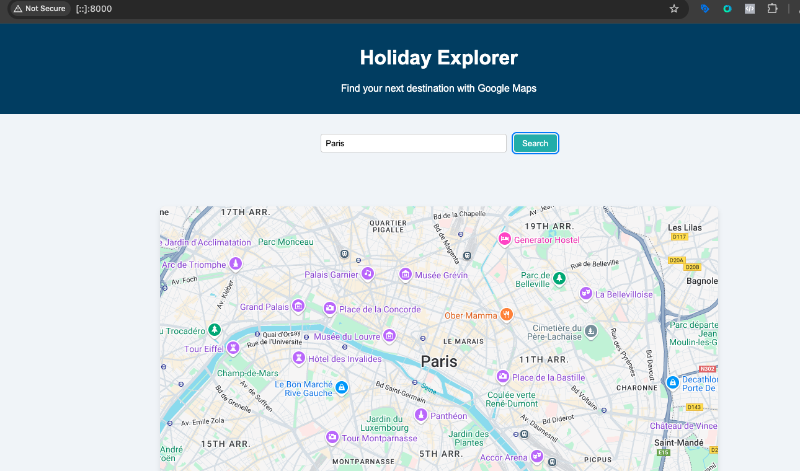
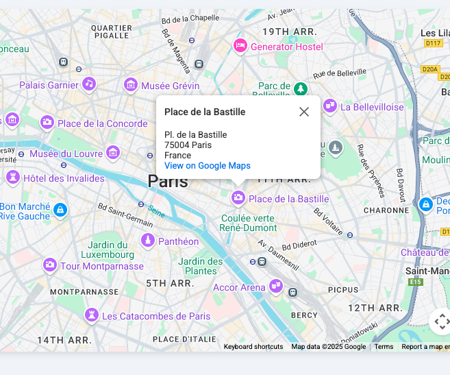
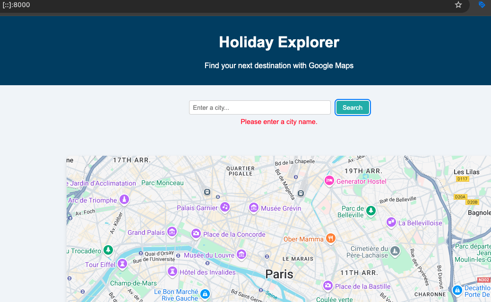
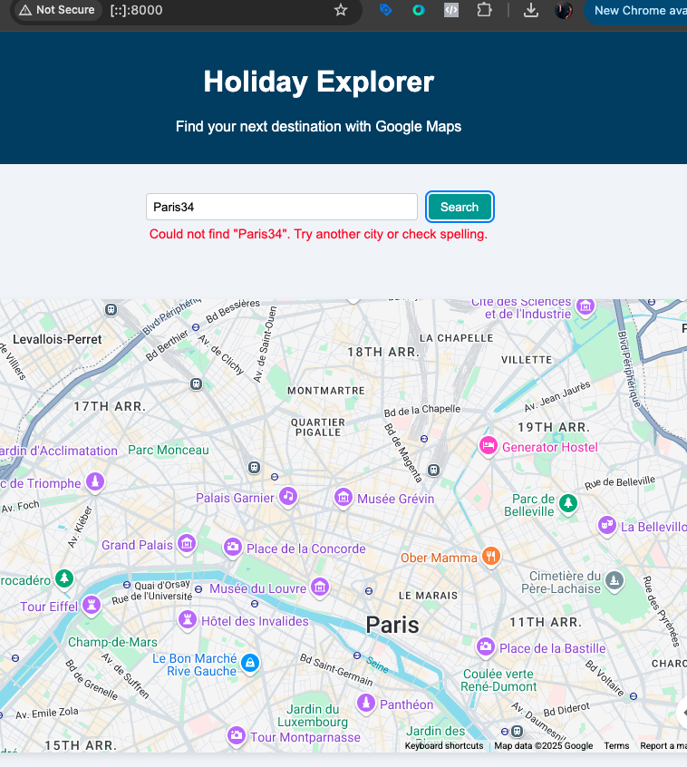
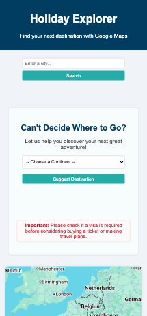
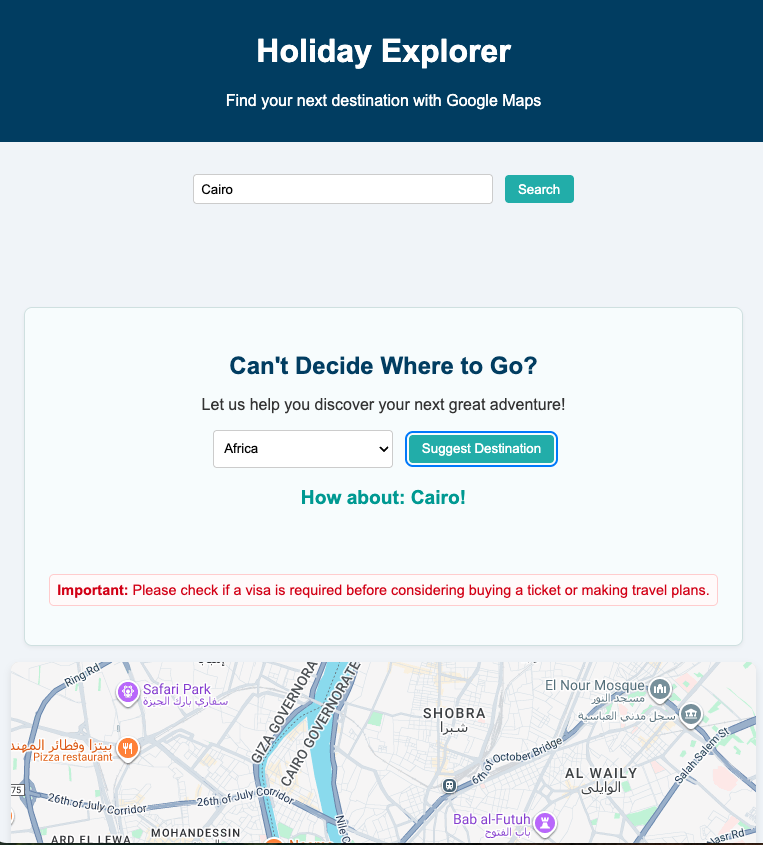

# 🧭 Holiday Explorer

🔗 **Live Demo**: [https://raduscripnic.github.io/holiday-explorer/](https://raduscripnic.github.io/holiday-explorer/)

---

## 🌍 Project Overview

**Holiday Explorer** is a responsive web application that helps users discover travel destinations using Google Maps and Places APIs. With a clean interface, users can search for cities and instantly view key points of interest like attractions, restaurants, and hotels — directly on a live interactive map.

---

## 🎯 Purpose & Motivation

Planning a holiday can be overwhelming — especially during the research stage. **Holiday Explorer** solves this by:

- Offering an intuitive, **visual-first experience** using Google Maps.
- Helping users explore **points of interest instantly**.
- Providing **random travel suggestions** for inspiration.

The design is mobile-first and accessibility-focused, supporting a wide range of users.

---

## 👥 Target Audience

- Casual or serious travelers
- Mobile and desktop users
- Individuals planning city-based holidays
- Users seeking quick destination ideas

---

## 🙋‍♂️ User Stories

| ID | User Story | Screenshot |
|----|------------|------------|
| 1 | As a traveler, I want to search for a city and see it on a map. |  |
| 2 | I want to view attractions, restaurants, and hotels nearby. |  |
| 3 | I want clear feedback if my input is invalid or empty. | <br> |
| 4 | I want the app to work well on mobile. |  |
| 5 | I want a surprise city suggestion when I can't decide. |  |

---

## ✨ Features

- 📍 Interactive Google Map with dynamic markers
- 🔎 Search for cities with auto-location & POIs
- 🏨 Explore nearby hotels, attractions, and restaurants
- 🧭 Random capital suggestion by continent
- 📱 Fully responsive and mobile-friendly
- ♿ Accessibility: ARIA labels, keyboard navigation, semantic HTML
- ⌨️ Pressing **Enter** triggers a city search
- ⚠️ Inline error messages for user guidance
- 🔗 Buttons to Booking.com and Skyscanner

---

## 🎨 UX & Accessibility

**Wireframes:** Designed in Figma (`/docs/design/wireframe.png`)  

**Accessibility Features:**
- Proper use of semantic HTML
- `aria-label` on all inputs and buttons
- `aria-live` regions for dynamic error feedback
- Fully keyboard-navigable
- Color contrast compliant (WCAG AA)

---

## 🛠️ Technologies Used

- HTML5 / CSS3 (Flexbox, Grid, Media Queries)
- JavaScript (ES6+)
- Google Maps JavaScript API
- Google Places API
- Google Geocoding API
- Git & GitHub
- [JSHint](https://jshint.com/)
- W3C HTML & CSS Validators

---

## 🧪 Testing Summary

📄 For full details, see [test-plan.md](./test-plan.md)

### ✅ Functional Tests

| Test | Input | Expected | Result | Screenshot |
|------|-------|----------|--------|------------|
| Search valid city | "Paris" | Map centers, POIs show | ✅ | paris-search.png |
| Empty input | "" | Error: input required | ✅ | error-empty.png |
| Invalid city | "Xyzabc" | Error: city not found | ✅ | error-invalid.png |
| Marker click | N/A | Info window opens | ✅ | map-markers.png |
| New search | "Rome" → "Tokyo" | Old markers cleared | ✅ | rome-to-kyo-clear.png |

### ✅ Responsiveness

| Device | Layout | Result |
|--------|--------|--------|
| Desktop (1920x1080) | Full view, no issues | ✅ |
| Tablet (768x1024) | Responsive stacking | ✅ |
| Mobile (375x667) | Mobile-first layout | ✅ |

### ✅ Accessibility

- Tab + Enter navigation → ✅  
- ARIA roles + `aria-labels` → ✅  
- Live error feedback → ✅  
- Color contrast validated → ✅

### ✅ Code Validation

| Type | Tool | Status |
|------|------|--------|
| HTML | W3C Validator | ✅ |
| CSS | W3C Validator | ✅ |
| JS | JSHint | ✅ |

---

## 🐛 Bug Fixes

| Issue | Fix | Status |
|-------|-----|--------|
| Enter key didn’t trigger search | Added event listener on input | ✅ |
| Previous markers stayed on new search | Added `clearMarkers()` function | ✅ |
| API key errors | Replaced with valid scoped key | ✅ |
| Map failed to load | Checked `initMap()` on load | ✅ |

---

## 🛠️ Development Cycle

The project was developed iteratively, with progress tracked through commits. Below is a summary of the main stages:

### Initial Setup
- Project scaffold with HTML, CSS, and JS.
- GitHub repo created and first commit pushed.

### Map Integration
- Added Google Maps API with a default Paris view.
- **Commit:** Added Google Maps integration with default center.

### Search & Error Handling
- Implemented city search using Geocoding API.
- Added inline error messages for invalid/empty input.

### Places & Markers
- Integrated Google Places API for attractions, restaurants, and hotels.
- Created `clearMarkers()` to reset the map state.

### Random Destination
- Added continent-based city suggestion feature.
- **Commit:** Added random destination button with city lists.

### User Experience Enhancements
- Added Enter key trigger for searches.
- Linked Skyscanner (flights) and Booking.com (hotels).

### Testing & Finalization
- Validated HTML, CSS, and JS.
- Fixed bugs and documented everything in README.

### 📜 Example Commit Log

| Commit Hash | Message | Stage |
|------------|--------|-------|
| a1b2c3d | Initial project setup with HTML/CSS/JS scaffold | Initial Setup |
| b2c3d4e | Added Google Maps API integration | Map Integration |
| c3d4e5f | Implemented city search with geocoding | Search Functionality |
| d4e5f6g | Added nearby places search and markers | Places & Markers |
| e5f6g7h | Added random destination suggestion feature | Random Destination |
| f6g7h8i | Improved UX with Enter key + external links | UX Enhancements |
| g7h8i9j | Bug fixes and validation compliance | Testing & Bug Fixes |

---

## 📚 Credits & Attribution

To clearly separate my work from external sources:

**Google Maps & Places API**
- Functions like `initMap()`, `createMarker()`, and use of `PlacesService` were adapted from official Google Maps documentation.
- Code was modified and extended for this project.

**Geocoding & Error Handling**
- Based on examples from Google API docs, adapted with custom validation and inline error messages.

**Booking.com & Skyscanner Links**
- External links provided for user convenience.

**Original Work**
- App design, random city suggestion feature, UX flow, and integration logic were created by Radu Scripnic.

**Testing Tools**
- W3C HTML Validator
- W3C CSS Validator
- JSHint

---

## 💾 Installation Instructions

```bash
git clone https://github.com/RaduScripnic/holiday-explorer
cd holiday-explorer
open index.html
